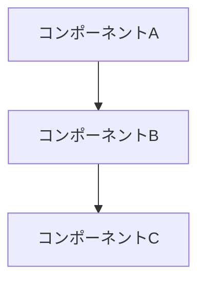

# Design Template Reference

> このファイルは `agents/designer.md` から段階的開示（Progressive Disclosure）で分離されたリファレンスです。
> エージェント実行時に `Read` して適用してください。

## 出力テンプレート: design.md

```markdown
# 設計書: [機能名]

## 概要
[設計の目的と範囲]

## 対応する要件
- FR-1, FR-2, FR-3
- NFR-1, NFR-2

## 設計方針
[採用するアプローチと理由]

## アーキテクチャ

### システム構成図



### コンポーネント

#### [コンポーネント名]
- **責務**: [役割]
- **入力**: [何を受け取るか]
- **出力**: [何を返すか]
- **依存**: [他のコンポーネント]
- **対応要件**: FR-X

## File Structure Plan

この設計で**触るファイル / 新規作成ファイル**を一覧化する。タスク分解時の Boundary（触らない領域）判定に使う。

```markdown
### 新規作成
- `src/components/ExampleComponent.tsx` — [責務]
- `src/services/ExampleService.ts` — [責務]
- `tests/services/ExampleService.test.ts` — [対応テスト]

### 変更（既存ファイル）
- `src/App.tsx` — [変更内容、例: ExampleComponent の配置]
- `src/routes.ts` — [変更内容]

### 触らない（意図的な Boundary）
- `src/legacy/` — 別 PR でリファクタ予定
- `src/analytics/` — スコープ外、既存動作を維持
```

cc-sdd の `_Boundary:_` 概念に倣い、**触らない領域を明示**することでスコープクリープを防ぐ。

## データ設計

### [エンティティ/型名]
```typescript
interface Example {
  id: string;        // 一意識別子
  name: string;      // 名前
  createdAt: Date;   // 作成日時
}
```

## API設計（必要な場合）

### POST /api/example
- **説明**: [何をするか]
- **対応要件**: FR-X
- **リクエスト**:
  ```json
  { "field": "value" }
  ```
- **レスポンス**:
  ```json
  { "id": "xxx", "status": "success" }
  ```
- **エラー**:
  - 400: バリデーションエラー
  - 401: 認証エラー

## 技術選定

| 項目 | 選定 | 理由 |
|------|------|------|
| [項目] | [技術] | [理由] |

## 設計上の決定事項

### ADR-1: [決定事項]
- **状況**: [背景]
- **決定**: [何を決めたか]
- **理由**: [なぜそうしたか]
- **代替案**: [検討した他の選択肢]

## セキュリティ考慮事項
- [考慮事項1]
- [考慮事項2]

## 完了条件（eval）

[この設計が「done」と言える条件。**この goal 固有**の機械判定を fenced code block で書く——flywheel の design-validator が validate 合格時にこの block を eval_cmd へ昇格させ、loop はこれが通るまで終わらない。プロジェクト全体の test/lint だけで済ませない（それは自動検出と同じで goal 固有性ゼロ）。1行 = 1コマンド（&& で連結される）]

```bash
pytest tests/test_[この機能].py
ruff check src/[この機能]
```

## 次のステップ
→ planner subagent でタスク分解
```
